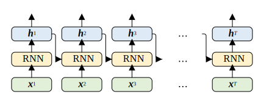
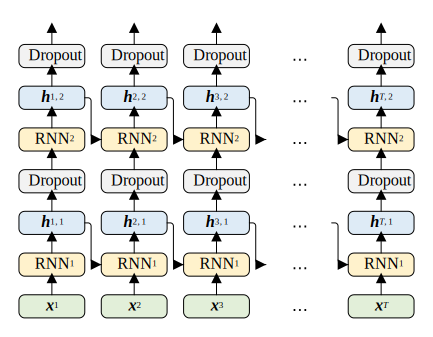
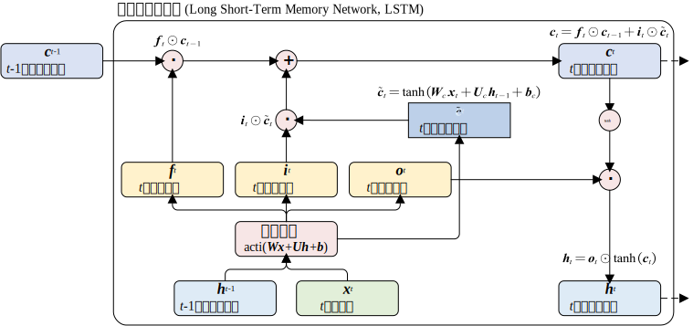
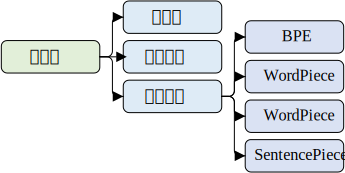
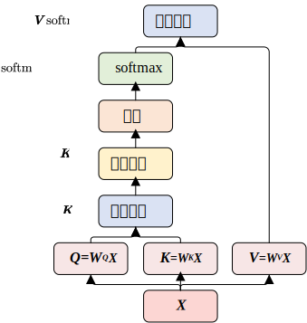
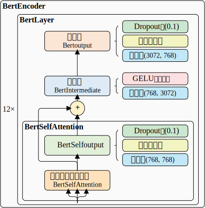
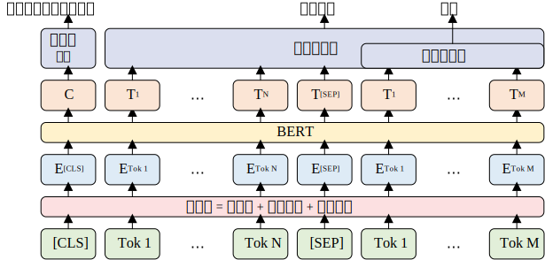
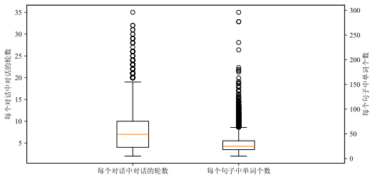

# 1 实验背景

科学技术的进步贯穿了人类发展的方方面面。它不仅仅是技术和知识的积累，更是一种持续革新的过程，对人类社会产生了深远的影响。随着时间的推移，人们对技术和科学的理解逐渐深化，并在不断探索中催生了计算机科学的诞生和蓬勃发展。

20世纪下半叶至21世纪初期，计算机技术经历了翻天覆地的变革。从最初的巨型机器，体积庞大、运算速度缓慢，到如今的个人电脑和智能移动设备，计算机的性能和普及程度实现了巨大的跨越。这种变化不仅改变了人们的工作和生活方式，也影响了社会的方方面面。

计算机的进步推动了信息时代的来临。在互联网的浪潮下，信息传播变得更快捷、全球联系更加紧密。个人电脑、智能手机等智能设备成为人们日常不可或缺的工具，社交、工作、娱乐等各个领域都得到了极大的改善和便利。这种计算机技术的迅速普及也为其他领域的发展铺平了道路，其中之一就是自然语言处理（Natural LanguageProcessing，NLP）。NLP致力于使计算机理解和处理人类语言，其发展也是计算机技术进步的一个重要方向。随着NLP技术的不断进步，语音识别、文本理解、自动翻译等领域取得了显著的进展，为人机交互提供了更加智能化的解决方案。

在NLP领域，预训练模型的出现更是带来了革命性的变化。这些模型利用大规模的文本数据进行预先训练，使得计算机能够更好地理解语言的结构和语境，提高了在各种NLP任务上的性能表现。BERT（Bidirectional Encoder Representations from Transformers）和GPT（Generative Pre-trained Transformer）等预训练模型的问世，为自然语言处理领域带来了新的里程碑。

情感识别作为NLP领域的一个重要分支，旨在识别和理解文本中的情感和情绪。随着人们在社交媒体上的大量交流，情感识别技术越来越重要。预训练模型的运用使得情感识别更加精准和高效，为企业的市场营销、舆情分析等提供了有力支持。

本实验基于预训练编码模型BERT，对情感识别领域中的对话情感识别进行探讨。全文共4章，剩余章节安排如下：

第2章：模型简介。主要介绍此次实验用到的各种神经网络，包括循环神经网络、分词器、Transformer架构和BERT模型。

第3章：模型的构建与实现。主要介绍此次实验的数据集以及所构建的模型。并且对实验结果进行了详细地分析。

第4章：总结。总结此次实验的过程以及收获。

# 2 模型简介

## 2.1 循环神经网络

前馈神经网络（Feedforward Neural Network，FNN）可视为多个简单非线性函数的复合，其构成了一个复杂的函数。其特征在于每次的输入独立存在，即网络的输出仅取决于当前输入。然而，在许多实际任务中，网络的输出不仅仅与当前输入相关，还与过去一段时间的输入相关，典型案例包括自然语言处理。此外，前馈神经网络要求输入和输出的维度固定，而针对时序数据（如视频、语言、文本等），其长度却是不固定的。正因为上述原因，前馈神经网络在自然语言处理领域显得捉襟见肘。

基于此，循环神经网络（Recurrent Neural Network，RNN）被提出用来解决与时序数据相关的问题。循环神经网络是一类具有短期记忆力的神经网络，其神经元不仅接受其他神经元的信息，还接受自身的信息，形成具有环路的网络结构。

循环神经网络的参数可以通过随时间反向传播（BackPropagation Through Time，BPTT）算法或实时循环学习（Real-Time Recurrent Learning，RTRL）算法进行优化。BPTT算法按照时间的逆序将损失一步步往前传递，当输入序列比较长的时候，会存在长程依赖问题，即梯度消失或梯度爆炸的问题，为了解决这个问题，人们引入门控机制（Gating Mechanism）对循环神经网络进行改进，提出了长短期记忆网络（Long Short-Term Memory Network，LSTM）算法和门控循环单元（Gated Recurrent Unit，GRU）算法。

在本次实验中，循环神经网络的结构主要应用LSTM算法，但是也会利用RNN算法和GRU算法进行对比，在本小节中，主要对以上这三个算法进行介绍。

### 2.1.1 RNN

#### 1. 简单循环网络

令向量$\boldsymbol     {x}_t \in \mathbb{R}^M$表示在时刻$t$时网络的输入，$\boldsymbol     {h}_t \in \mathbb{R}^D$表示隐藏层状态（即隐藏层神经元活性值），则$\boldsymbol     {h}_t$不仅和当前时刻的输入$\boldsymbol     {x}_t$相关，也和上一个时刻的隐藏层状态$\boldsymbol     {h}_{t-1}$相关。简单循环网络在时刻$t$的更新公式为：隐藏层净输入$\boldsymbol      z_{t}=\boldsymbol      U\boldsymbol     {h}_{t-1}+\boldsymbol      W\boldsymbol     {x}_{t}+\boldsymbol     {b}$，隐藏层状态$\boldsymbol      h_t=f(\boldsymbol      z_t)=f(\boldsymbol      U\boldsymbol     {h}_{t-1}+\boldsymbol      W\boldsymbol     {x}_{t}+\boldsymbol     {b})$。其中，$\boldsymbol      U \in \mathbb{R}^{D \times D}$为状态－状态权重矩阵，$\boldsymbol     {W} \in \mathbb{R}^{D \times M}$为状态－输入权重矩阵，$\boldsymbol     {b} \in \mathbb{R}^D$为偏置向量，$f(\cdot)$是非线性激活函数，通常为Tanh函数（PyTorch中默认）或Logistic函数。简单循环网络如图所示。

在自然语言处理领域，有许多不同类型的问题，基于此RNN也产生了许多不同的变体。对于序列数据分类问题，可以使用序列到类别模式；对于序列标注任务，由于输入与输出一一对应，所以可以使用同步的序列到序列模式，即上述的简单循环网络结构；对于输入与输出不是一一对应的任务，如机器翻译等，可以使用异步的序列到序列模式。在此次任务中和PyTorch的实现中，均采用同步序列到序列模式，所以对其他两种模式不作过多的说明。

#### 2. 循环神经网络的技巧

为了便于后续模型的介绍，在此首先介绍循环神经网络中的Dropout和双向循环神经网络（Bidirectional Recurrent Neural Network，Bi-RNN）。LSTM和GRU的Dropout与双向技巧与此类似。

在RNN的模型中，一般在深度方向（垂直方向）上插入Dropout层，随机设置一些隐藏状态$\boldsymbol h$中的值为0，如图所示。

在简单循环网络中，当前神经元的隐藏层状态$\boldsymbol {h}_t$与当前时刻的输入$\boldsymbol     {x}_t$相关和上一个时刻的隐藏层状态$\boldsymbol     {h}_{t-1}$相关。但是在序列数据中，某一数据可能不仅与其上文相关，还与其下文相关，Bi-RNN就是用于解决此问题的。在Bi-RNN中有两个RNN分别按照时间顺序和逆序进行展开，最终的输出为两个RNN输出的拼接，如图所示。

### 2.1.2 LSTM网络

LSTM网络是为了解决长程依赖问题所提出的一个循环神经网络的变体。其引入了新的内部状态和门控机制，使网络能够处理长序列信息并更好地对序列信息进行记忆。

首先利用利用当前时刻的输入$\boldsymbol     {x}_t$相关和上一个时刻的外部状态$\boldsymbol {h}_{t-1}$进行仿射变换可以得到当前时刻的候选状态$\tilde{\boldsymbol {c}}_t$。除此以外，还可以得到三个门，分别是遗忘门、输入门和输出门。其中，遗忘门$\boldsymbol f_t$用于控制上一个时刻的内部状态$\boldsymbol  {c}_{t-1}$需要遗忘多少信息，输入门$\boldsymbol i_t$用于控制当前时刻的候选状态$\tilde{\boldsymbol  {c}}_t$有多少信息需要保存，输出门用于控制当前时刻的内部状态$\boldsymbol  {c}_t$有多少信息需要输出给外部状态$\boldsymbol  {h}_t$。

利用当前时刻的$\tilde{\boldsymbol {c}}_t$和上一时刻的内部状态$\boldsymbol  {c}_{t-1}$分别与遗忘门$\boldsymbol f_t$和输入门$\boldsymbol i_t$点乘可以得到当前时刻的内部状态$\boldsymbol  {c}_{t}$。更进一步，当前时刻的内部状态$\boldsymbol  {c}_{t}$与输出门$\boldsymbol {o}_t$点乘可以得到当前时刻的外部状态$\boldsymbol  {h}_t$。其中，外部状态$\boldsymbol  {h}$每个时刻都会被重写，因此可以看作一种短期记忆，而内部状态$\boldsymbol  {c}$借助遗忘门可以将信息保存一段时间，可以看作是一种长短期记忆。

### 2.1.3 GRU网络

GRU网络可以看作是LSTM网络的一种变体，是一种比LSTM网络更加简单的循环神经网络。首先，由于在LSTM网络中，遗忘门$\boldsymbol f$和输入门$\boldsymbol i$是互补关系，具有一定的冗余性。GRU网络直接使用一个更新门$\boldsymbol z$来控制当前状态需要从历史状态$\boldsymbol h$中保留多少信息，以及需要从候选状态$\tilde{\boldsymbol{h}}$中接受多少新信息。此外，与LSTM网络类似，当前时刻的候选状态$\tilde{\boldsymbol{h}}_t$是当前时刻的输入$\boldsymbol     {x}_t$相关和上一个时刻的状态$\boldsymbol {h}_{t-1}$的仿射变换，利用一个重置门$\boldsymbol r_t$来控制当前时刻的候选状态$\tilde{\boldsymbol{h}}_t$是否依赖于上一时刻的状态$\boldsymbol {h}_{t-1}$。

## 2.2 分词器

人们对于句子的理解基于对其中每个单词的理解，计算机在理解句子时也不例外，需要逐个理解其中的单词。在自然语言处理中，分词器的任务是将句子拆分为一个个单词。由于这些单词可能不仅仅是完整的词汇单元，还包括一些特殊标记，因此在NLP领域，我们通常将它们称为token，因而分词器也被称为tokenizer。其作用在于将连续的文本序列转换成计算机能够处理的离散单元，为后续的语言模型或其他NLP任务提供输入。这个过程对于计算机理解和处理自然语言的任务至关重要。

根据其工作原理和分割单元的不同，分词器主要可以分为三类，分别是基于词、基于字符以及基于子词。

首先，词是最自然的语言单元，所以一个很自然的想法就是将一个句子分解为一个个单词。对于英语来说，可以利用其天然存在的空格对句子进行拆分（在实际操作中，可能还需要对一些符号进行特殊处理），常用的分词器有spaCy和Moses。虽然中文不具备这样的分隔符，但是类似Jieba、HanLP和LTP等分词器基于规则与模型，可以取得良好的分词效果。虽然基于词的分词器很符合直觉，但是其存在许多问题：

* **词汇表过于庞大：**基于词的分词器的词汇表中可能包含大量出现次数比较少的单词，这样会导致模型大部分参数都集中在输入输出层，不利于模型的学习。
* **OOV（Out-of-Vocabulary）问题：**基于词的分词器无法很好地处理处理未知或罕见的词汇的问题。
* **不利于模型学习词缀之间的关系：**基于词的分词器不利于模型学习词缀之间的关系，例如模型学到的old，older和oldest之间的关系无法泛化到smart、smarter和smartest。

针对词汇表过大和OOV问题，可以采用基于字符的方法解决。但是由于字符数量太小，我们在为每个字符学习嵌入向量的时候，每个向量就容纳了太多的语义在内，学习起来非常困难。

所以一种折中的方法诞生了，基于子词的分词器介于上述两者之间，其处理原则是，常用词应该保持原状，生僻词应该拆分成子词以共享token压缩空间。这种方法平衡了词汇量和语义独立性，是相对较优的方案。但是，如何将单词划分为子词又是一个难题，子词的划分方法主要有字节对编码（Byte-Pair Encoding，BPE）、WordPiece、Unigram和SentencePiece。一般来说，Unigram算法与SentencePiece算法一起使用，而在BERT中使用的WordPiece算法，由于WordPiece算法与BPE类似，所以以下内容先介绍BPE算法，然后进一步介绍WordPiece算法。综上所述，分词器的分类如图所示。

BPE算法首先从一个包含所有字符的初始词汇表开始，在每次迭代中，BPE算法会统计文本中字符对（或者字节对）的出现频率，然后合并出现频率最高的相邻字符对成为一个新的token。BPE算法会不断迭代这个过程，直到达到预定的词汇表大小或者达到停止条件（如合并次数、词汇表大小等）。合并的过程将不断产生新的子词，形成一个动态变化的词汇表，其中包含单字符、常见组合，以及更长的子词。

WordPiece算法与BPE算法类似，都是基于统计的子词分割算法。但是与BPE算法不同的是，在合并token的过程中，BPE算法选择的是出现频率最高的token对，而WordPiece算法选择的是能够最大化训练集数据似然的token对。具体来说，假设有两个token分别为$\text{token}_i$和$\text{token}_j$，WordPiece算法选择$\begin{aligned} \frac{P(\text{token}_i\text{token}_j)}{P(\text{token}_i)P(\text{token}_j)} \end{aligned} $最大的token对。

## 2.3 Transformer架构与预训练编码模型BERT

### 2.3.1 Transformer架构

Transformer架构由Vaswani等人于2017年提出，其完全抛弃了传统的循环神经网络和卷积神经网络（Convolutional Neural Networks，CNN），转而采用自注意力机制。这意味着它可以并行处理输入序列，避免了RNN的逐步处理，极大地提高了计算效率。

#### 1. 自注意力（Self-Attention）机制与多头注意力机制

自注意力机制允许模型在处理序列数据时同时考虑序列中各个位置的信息，并赋予不同位置的词语不同的权重，从而更好地捕捉上下文关系。

对于一个输入序列（比如文本句子），首先通过词嵌入或其他方式将每个词或符号转换为一个矩阵表示，记作$\boldsymbol  {X}=\left[\boldsymbol  {x}_1, \cdots, \boldsymbol  {x}_N\right] \in \mathbb{R}^{D_{x} \times N}$。自注意力机制将输入项通过线性映射转化为三个部分，分别为查询矩阵$\boldsymbol{Q}=\boldsymbol{W}_Q \boldsymbol{X} \in \mathbb{R}^{D_k \times N}$、键矩阵$\boldsymbol{K}=\boldsymbol{W}_K \boldsymbol{X} \in \mathbb{R}^{D_k \times N}$和值矩阵$\boldsymbol{V}=\boldsymbol{W}_V \boldsymbol{X} \in \mathbb{R}^{D_v \times N}$。其中$\boldsymbol  {W}_Q \in \mathbb{R}^{D_k \times D_x}$，$\boldsymbol  {W}_K \in \mathbb{R}^{D_k \times D_x}$，$\boldsymbol  {W}_V \in \mathbb{R}^{D_v \times D_x}$分别为可学习的线性映射的参数矩阵。通过计算查询矩阵$\boldsymbol{Q}$与键矩阵$\boldsymbol K$之间的相似度，得到每个位置对于当前查询矩阵$\boldsymbol{Q}$的权重分布。通过对每个位置的权重与对应位置的值矩阵$\boldsymbol{V}$进行加权求和，得到当前位置的自注意力表示。输出矩阵序列可以简写为
$$
\boldsymbol{H}=\boldsymbol{V} \operatorname{softmax}\left(\frac{\boldsymbol{K}^{\mathrm{T}} \boldsymbol{Q}}{\sqrt{D_k}}\right)
$$
整个过程如图所示。

为了增加模型的表征能力，自注意力通常采用多头机制，将输入序列$\boldsymbol X$利用不同的线性映射得到多组查询矩阵$\boldsymbol{Q}$、键矩阵$\boldsymbol K$和值矩阵$\boldsymbol{V}$并分别计算多组注意力表示，最后进行拼接或加权汇总。

#### 2. Transformer结构

Transformer由编码器和解码器组成，其中编码器负责将输入序列转换为隐藏表示，解码器则基于编码器的输出生成目标序列。其中，编码器由多个具有相同结构的编码器模块堆叠而成，每个编码器模块包含多头自注意力模块和带残差连接的前馈神经网络模块，用于将输入序列中的信息转换为一系列表示，捕捉输入序列的特征和上下文信息并作为解码器的输入，为解码器提供序列的表示和上下文信息。解码器由多个解码器模块组成，每个编码器模块包含自注意力模块、编码器-解码器注意力模块和前馈神经网络模块三部分，通过接收来自编码器的表示和上下文信息和逐步解码和自注意力计算，生成符合任务要求的输出序列。Transformer结构如图所示。

在具体实现中，Transformer结构还有一些细节：

* **位置编码：**将位置编码添加到编码器和解码器堆栈底部输入向量中，给予词向量序列信息。位置编码被表示为
  $$
  \begin{aligned}
  P E_{(p o s, 2 i)} & =\sin \left(\frac{\text { pos }}{10000^{2 i / d_{\mathrm{model}}}}\right) \\
  P E_{(p o s, 2 i+1)} & =\cos \left(\frac{\text { pos } }{ 10000^{2 i / d_{\mathrm{model}}}}\right)
  \end{aligned}
  $$
  其中，$\text{pos}$是位置，$i$是维度，$d_\text{model}(=512)$是模型的维度。这样，位置编码的每个维度对应于一条正弦曲线，如图所示。

  

* **注意力掩码：**在每个多头注意力模块中，即在编码器和解码器的多头自注意力模块以及在解码器的编码器-解码器注意力模块中都需要进行掩码，而且掩码的方法以及作用不尽相同。首先，在编码器和解码器的多头自注意力模块，在输入序列中padding对应的位置，将输出的注意力分数归零，以确保padding对自注意力的计算没有贡献。具体来说，在计算softmax之前，对分子上被屏蔽的元素设置为无穷大，这样softmax就会把这些值变成零且能保证softmax输出之和仍为1。在解码器的编码器-解码器注意力模块中，掩码的作用是防止解码器在当前时间步预测时可以获取未来时间步的信息。

* **层归一化：**在序列任务特别是NLP任务中，序列数据的长度可能不一样，这会导致批量的均值和方差估计不准确，所以在Transformer结构中使用层归一化代替批量归一化。

### 2.3.2 预训练编码模型BERT

BERT由Google在2018年提出，是一种基于Transformer架构的预训练语言模型。它在自然语言处理领域取得了巨大的成功，通过无监督的方式在大规模文本语料上进行预训练，然后在各种NLP任务上进行微调，取得了令人瞩目的效果。在本小节中，主要对BERT的结构以及预训练和微调的方法进行阐述。

#### 1. BERT的结构

BERT采用了与Transformer的编码器类似的结构，由嵌入层（Embedding Layer）、多个具有相同结构的编码器模块以及一个全连接层组成，具体结构如图所示。$\text{BERT}_\text{BASE}$和$\text{BERT}_\text{LARGE}$的结构基本相同，只是$\text{BERT}_\text{LARGE}$模型的广度和深度均要比$\text{BERT}_\text{BASE}$大。由于下述实验主要使用预训练编码模型$\text{BERT}_\text{BASE}$，所以在此只对其进行说明。

首先是嵌入层。嵌入层是NLP模型的关键组成部分。尽管分词器已将句子转化为一系列token，但这些token原始形式并不能直接供神经网络使用。嵌入层的任务是将这些token转换为密集的向量表示。在BERT中，输入由三部分组成：token、句子编码和位置编码。句子编码用于区分词向量来自不同句子，而位置编码则帮助模型理解词语在句子中的位置关系。

> 在HuggingFace的实现中，三个嵌入层分别命名为word_embeddings、token_type_embeddings和position_embeddings。

对于BERT的三个输入部分，分别经过嵌入层转换为Token_Embeddings、Segment_Embeddings和Position_Embeddings。这些部分的向量表示会相加，然后通过一个层归一化和Dropout层，生成最终的输出向量。这样的处理方式使得模型能够综合考虑词语的语义、句子边界以及词语在句子中的位置信息，为模型提供了更为丰富和全面的输入。整个嵌入层的工作原理如图所示。

接下来是多个结构相似的编码器模块。BERT的编码器模块与Transformer的编码器模块类似，不同之处在于在每个编码器模块之后，BERT添加了中间层和输出层，中间层通过全连接层将维度扩展，而输出层再将维度缩减回原始大小。编码器模块如图所示。

这个过程在模型中引入了额外的非线性转换，中间层的维度扩展使得模型能够对特征进行更深入的变换和学习，从而捕捉更复杂、更抽象的特征。而在输出层，维度的缩减则有助于保留重要的信息，并确保模型的输出与预期的维度相匹配。这种操作方式有助于增强模型的表征能力，提高其对不同语境和语义信息的理解。

编码器模块的输出经过一个全连接层得到最终的输出。对于BERT而言，其输入与输出的维度是相同的，其输出是对输入信息的一种编码，这种编码信息经过不同的神经网络可以适用于不同的下游任务。

#### 2. BERT的预训练

预训练的主要目标是使模型能够学到通用的语言知识。相对于有监督训练，无监督训练的成本更低，更适用于预训练任务。BERT在预训练过程中将两个句子拼接在一起，并对其中一些token进行随机遮挡。在这个预训练过程中，BERT模型完成两个子任务，即下一个句子预测（Next Sentence Prediction，NSP）和掩蔽语言模型（Masked Language Model，MLM）。

具体而言，NSP任务旨在预测输入的两个句子在原始文本中是否是连续的，即它们是否是相邻的句子。这个任务有助于模型理解文本之间的逻辑关系和连贯性。而在MLM任务中，输入句子中的一定比例（15%）的token会被随机遮挡或替换为特殊的标记。模型的目标是根据上下文中其他token的信息来预测被遮挡的token的原始内容。BERT预训练过程如图所示。

此外，为了使训练阶段和微调阶段输入的序列信息尽量相同，对于15%的遮挡标记，80%的位置会使用[MASK]代替，10%的单词替换为一个随机的单词，而另外的10%的单词则保持不变。这种预训练的设计使得BERT模型能够在学习通用语言表示的同时，适应各种自然语言处理任务。

#### 3. BERT的微调

为了适应各种下游任务，经过预训练的BERT模型通过额外简单的分类器进行有监督训练，以将其输出应用于不同领域。微调后的BERT模型展现出了优秀的泛化性能。

BERT的微调主要针对四类下游任务：句子对分类、单句分类、问答和单句标注。针对不同任务，需要利用预训练BERT模型的不同输出部分。具体来说，对于句子对分类和单句分类，使用了特殊的[CLS]标记对应的输出，并将其输入到分类器中进行分类，输出结果即为所需分类；至于问答任务，则利用第二个句子中所有标记的输出进行处理，以定位正确答案在第二个句子中的位置；对于单句标注任务，使用了除[CLS]标记外其他所有标记对应的输出进行分类。这种针对性的输出选择策略有助于最大化BERT模型在各个任务上的效能。BERT微调过程如图所示。

# 3 模型的构建与实现

此次实验为了探究预训练编码模型BERT对于对情感识别领域中的对话情感识别的作用。本章首先介绍此次实验所用到的数据集，然后介绍主要模型的结构，最后给出实验结果和实验的各种细节。

## 3.1 数据集与预处理过程

本次实验的数据集来自DailyDialog，这是一个用于对话系统和情感识别的常用数据集。数据集中的对话是来自于日常生活中真实的对话，包括了多样的情感和语境。相比于来源于Twitter和微博的数据集，DailyDialog数据集中的数据来自于英语学习者相关的网站，并且使用了一个开源的英文自动纠错程序来消除了简单的英语单词拼写错误问题，使其主题相对集中，语法相对规范。

|                           对话句子                           |   情绪   | 行动 |
| :----------------------------------------------------------: | :------: | :--: |
|    So Dick , how about getting some coffee for tonight ?     |   快乐   | 指令 |
|    Coffee ? I don ’ t honestly like that kind of stuff .     |   厌恶   | 承诺 |
| Come on , you can at least try a little , besides your cigarette . | 没有情绪 | 指令 |
| What ’ s wrong with that ? Cigarette is the thing I go crazy for . |   愤怒   | 通知 |
|                     Not for me , Dick .                      | 没有情绪 | 通知 |

对于对话中的每一个句子，都标注了对话的行动与情感。其中，行动标签分为4类，分别为：通知、提问、指令和承诺，情感标签分为7类，分别为：没有情绪、愤怒，厌恶、恐惧、快乐、悲伤和惊讶，其中没有情绪标签在预测时需要被剔除。

DailyDialog数据集一共有13118个对话，每轮对话大概有7.8轮且每个句子中大约有29.1个单词。每个对话的轮数以及每个句子中token的个数的箱线图与描述性统计分析如下。

| 描述性统计分析 | 每个对话中的轮数 | 每个句子中token的个数 |
| :------------: | :--------------: | :-------------------: |
|     平均值     |      7.850       |        29.120         |
|     最小值     |        2         |           5           |
|   25%分位数    |        4         |          18           |
|   50%分位数    |        7         |          25           |
|   75%分位数    |        10        |          36           |
|     最大值     |        35        |          296          |

## 3.2 模型的构建

如前所述，BERT模型对应于[CLS]的输出包含了整个输入句子的语义信息，可以使用这个语义语义信息经过一个分类器得到这句话对应的情感。在对话情感识别中，对话的上下文也包含了一定有助于情感识别的信息，所以在使用BERT编码每个句子之后没有直接利用分类器对句子进行分类，而是利用一个LSTM网络让其获取对话上下文的信息再进行分类。此外，对话的行动也有可能对对话的情感有一定的影响，所以在此次实验中构建了一个多任务的分类器，以促进两个任务的学习。模型的结构如图所示。

我进行了多次的消融实验，经过对比分析上述的假设是成立的，且经过预训练的模型BERT对情感识别任务具有强大的作用。

## 3.3 实验细节与结果分析

所有实现均在一台配备RTX 3090显卡（24GB）的Ubuntu计算机上使用PyTorch 2.0完成。由于显存的限制，批量大小均设置为4，学习率设置为$1\mathrm{e}-6$并使用了学习率预热和衰减的方法。

### 3.3.1 预训练BERT模型对实验结果的影响

首先，使用预训练的BERT模型与LSTM组成神经网络，并利用全量更新的方式对模型进行训练。从图中可以看出，对于分类任务而言，由于预训练模型的使用，在第125个batch时就已经收敛到比较高的水平，在验证集中情感分类准确率达到65.03%。最终在第700个batch达到最高水平，在验证集中情感分类准确率达到66.82%，且在测试集中的情感分类准确率达到63.10%。

在对BERT参数冻结之后，虽然效果相比于全参微调要差（在验证集中情感分类准确率达到64.80%，且在测试集中的情感分类准确率达到60.59%），但是由于其不用计算和存储BERT模型参数的梯度，所以计算速度和显存占用量都比全参微调要好，也是一种不错的选择。此外，在对BERT参数重置之后，由于没有使用预训练而直接微调，模型一直无法得到准确的预测。从另一个方面也说明，预训练模型中预训练与微调结合的方法是必不可少的。

此外，还使用了更大规模的$\text{BERT}_\text{LARGE}$模型进行了比较。由于显存的限制，我冻结了BERT模型的参数，以便进行对比分析。尽管已经对后续神经网络进行了调整，但在投入更多计算资源的情况下，并未观察到性能的显著提升。这表明模型规模的增大并非总能带来更好的效果。对于小型任务，选择规模较小的模型可能会带来更高的效率和更优越的性能，这一点值得注意。

### 3.3.2 多任务损失对实验结果的影响

该实验采用了多任务损失函数，要求BERT和LSTM结构同时学习情感分类和行动分类的信息。当将损失平衡因子$\alpha$设为0时，观察到情感分类准确率下降，表明这种多任务损失对情感分类准确性有所帮助。设置$\alpha$为0.5时，情感分类准确率达到最高值，在测试集中达到了63.33%。

另外，值得注意的是行动分类的准确率较低。即便将损失平衡因子$\alpha$设为5，准确率仍有所提升但仍然偏低，在测试集上仅为46.73%。因此，我将多任务损失函数改为仅针对行动进行预测，然而即便如此，行动分类的准确率仍然较低，这表明该模型结构可能不太适用于行动分类任务。

值得说明的是，由于将损失平衡因子$\alpha$设置为0.5之后情感分类准确率最高，所以后续的实验均设置$\alpha=0.5$。

### 3.3.3 改进模型的结构对实验结果的影响

#### 1. BiLSTM网络

鉴于LSTM网络只能捕获下文信息，我尝试将其改为BiLSTM网络，以便获取上下文信息。然而，我发现准确率提升并不明显，如图中黄线所示。这可能是因为使用BiLSTM网络后，参数和输出维度都会翻倍。为了解决这一问题，我将BiLSTM网络中的双层结构改为单层，观察到情感识别准确率有所提升。在验证集上达到了69.91%，在测试集上达到了65.91%的准确率。

#### 2. 更大的模型结构

在此次实验中，LSTM的输出维度为1024，BiLSTM的输出维度为$1024\times 2 = 2048$，而情绪和行动分类个数分别为6类和4类，维度的骤降可能不利于模型的泛化，所以我使用了两层的全连接层，其中添加的隐藏层有512个神经元。但是模型的整体表现不佳。

为了进一步增加模型的表达能力，我采用了BiLSTM模型，并适当增加了全连接层的宽度，将隐藏层的输入维度设为4096，输出维度设为1024，并尝试了不同的Dropout参数进行对比。结果显示，采用更大规模的模型在验证集上的效果更佳，但仍然存在过拟合问题。

#### 3. RNN和GRU

正如之前提到的，除了LSTM网络外，循环神经网络还包括RNN网络和GRU网络等变种。我对比了将LSTM网络替换为其他类型的循环神经网络。结果显示，采用RNN网络的准确率比使用LSTM网络和GRU网络更高。在验证集上，准确率达到了66.59%，在测试集上也有64.54%的准确率。

### 3.3.4 不使用上下文信息对实验结果的影响

由于预训练编码模型BERT经过大量数据进行无监督预训练，并在多种下游任务中进行微调，其编码能力很强大，所以我也尝试不使用循环神经网络融合上下文信息，直接将BERT的输出传递给前连接层，发现获得比较好的效果。在平衡因子$\alpha$设为0.5时，$\text{BERT}_\text{BASE}$模型在测试集中的情感分类准确率达到了70.99%，不经过微调的$\text{BERT}_\text{LARGE}$模型的准确率也有70.16%。此外，从图中可以看出，$\text{BERT}_\text{BASE}$模型刚开始训练就已经达到很高的准确率。

从图中可以看出，使用LSTM提取上下文信息可能会削弱预训练编码模型BERT的表达能力，反而会让分类任务性能有所下降。另外，当平衡因子$\alpha$设为1时，我们获得了本次实验最佳且最平衡的成绩。在测试集中，情感分类准确率达到了70.99%，行动分类准确率达到了71.80%，总体分类准确率达到了71.40%。

> 为了获得最均衡的成绩，保存的模型是总分类准确率最好的模型而不是情感分类准确率最好的模型

### 3.3.5 实验结果汇总与分析

除了上述所描述的实验结果，本实验还针对其他参数做了许多消融实验，实验结果如表所示。其中，下划线为影响某个因素中的最好结果，加粗为整个实验中的最好结果。

|      影响因素       |    BERT    |   循环结构    |    线性层数量    | Dropout | 平衡因子$\alpha$ |      ALLACC       |    EmotionACC     |      ActACC       |
| :-----------------: | :--------: | :-----------: | :--------------: | :-----: | :--------------: | :---------------: | :---------------: | :---------------: |
|   预训练BERT模型    |    全参    |     LSTM      |       单层       |    0    |        1         |   <u>0.5470</u>   |   <u>0.6310</u>   |   <u>0.4630</u>   |
|                     |    冻结    |     LSTM      |       单层       |    0    |        1         |      0.5191       |      0.6059       |      0.4323       |
|                     |    重置    |     LSTM      |       单层       |    0    |        1         |      0.3026       |      0.3485       |      0.2567       |
|                     | Large+冻结 |  LSTM(2048)   |       单层       |    0    |        1         |      0.5050       |      0.5847       |      0.4253       |
|      平衡因子α      |    全参    |     LSTM      |       单层       |    0    |        0         |         -         |      0.6234       |         -         |
|                     |    全参    |     LSTM      |       单层       |    0    |       0.5        |      0.5083       |   <u>0.6333</u>   |      0.3833       |
|                     |    全参    |     LSTM      |       单层       |    0    |        5         |      0.5400       |      0.6128       |   <u>0.4673</u>   |
|                     |    全参    |     LSTM      |       单层       |    0    |      infty       |         -         |         -         |      0.4668       |
|    bidirectional    |    全参    |    BiLSTM     |       单层       |    0    |       0.5        |      0.5310       |      0.6302       |      0.4318       |
|                     |    全参    |    BiLSTM     |       单层       |    0    |        1         |      0.5193       |      0.6143       |      0.4243       |
|                     |    全参    | BiLSTM(单层） |       单层       |    0    |       0.5        |      0.5539       |   <u>0.6591</u>   |      0.4488       |
|                     |    全参    | BiLSTM(单层） |       单层       |    0    |        1         |      0.5882       |      0.6538       |   <u>0.5226</u>   |
| 线性层数量与Dropout |    全参    |     LSTM      | 双层(1024, 512)  |    0    |       0.5        |      0.5392       |      0.6279       |      0.4506       |
|                     |    全参    | Bi-LSTM(2048) | 双层(4096, 1024) |    0    |       0.5        |      0.5286       |      0.6203       |      0.4368       |
|                     |    全参    | Bi-LSTM(2048) | 双层(4096, 1024) |   0.1   |       0.5        |      0.5201       |      0.6211       |      0.4191       |
|                     |    全参    | Bi-LSTM(2048) | 双层(4096, 1024) |   0.5   |       0.5        |      0.5271       |      0.6226       |      0.4315       |
|                     |    全参    | Bi-LSTM(2048) | 双层(4096, 1024) |   0.7   |       0.5        |      0.5290       |      0.6249       |      0.4331       |
|      循环结构       |    全参    |      RNN      |       单层       |    0    |        1         |   <u>0.5863</u>   |   <u>0.6454</u>   |      0.5272       |
|                     |    全参    |      GRU      |       单层       |    0    |        1         |      0.5220       |      0.6203       |      0.4237       |
|     对话上下文      |    全参    |     None      |       单层       |    0    |       0.5        |      0.6990       | <u>**0.7099**</u> |      0.6881       |
|                     |    全参    |     None      |       单层       |    0    |        1         | <u>**0.7140**</u> | <u>**0.7099**</u> | <u>**0.7180**</u> |
|                     | Large+冻结 |     None      |       单层       |    0    |       0.5        |      0.5801       |      0.7016       |      0.4585       |

从上述实验可以看出，预训练编码模型BERT具有强大的表达能力，在经过较少的训练就能够达到很好的性能。在使用预训练编码模型时应该注意：

* **分类器的复杂度平衡：**针对简单的分类任务时，选择的分类器应该匹配任务的复杂度。过于复杂的分类器可能会削弱预训练模型原有的表达能力。因此，在设计分类器时需要在精度和模型复杂度之间取得平衡。
* **任务大小与预训练模型的选择：**根据任务的规模和复杂程度选择适当大小的预训练编码模型是至关重要的。对于小型任务，选择相对较小的预训练模型既能提高模型的性能，又能提升模型运行的效率。这样做还有助于减少资源需求，加快训练和推理速度。
* **迁移学习策略：**在使用预训练编码模型时，需要考虑迁移学习的策略。有时候，仅冻结预训练模型的底层，只微调顶层，或者通过逐步解冻层来逐渐微调模型，都是有效的迁移学习策略。选择适当的策略有助于平衡模型的泛化能力和训练速度。
* **领域特定的微调：**某些情况下，预训练编码模型的泛化能力可能不足以完全适应特定领域的任务。在这种情况下，需要考虑在预训练模型上进行领域特定的微调，以提高模型在特定领域的性能。
* **超参数调整：**不同的任务和数据集可能需要不同的超参数设置。对于使用预训练编码模型的任务，经常需要对学习率、批量大小、优化器等超参数进行调整，以获得更好的性能。

# 4 总结

本实验探讨了预训练编码模型BERT在对话情感识别任务上的应用和效果。实验使用了DailyDialog数据集，该数据集包含了多样的情感和语境，适合用于对话情感识别的研究。实验分别使用了不同的预训练编码模型、循环神经网络结构、多任务损失函数和分类器结构，对模型的性能进行了对比和分析。实验结果表明，预训练编码模型BERT具有强大的表达能力，能够在较少的训练中达到很好的性能，且不需要使用循环神经网络融合上下文信息。实验还发现，模型的规模、复杂度和迁移学习策略对模型的泛化能力和训练速度有重要影响，需要根据任务的规模和复杂程度进行适当的选择和调整。本实验为使用预训练编码模型BERT进行对话情感识别提供了一些有益的启示和经验。
